# DOCKER

### 1. Instala docker en una máquina y configúralo para que se pueda usar con un usuario sin privilegios.

Para el uso de docker copiamos la maquina virtual ya preparada para ello, En el caso que partamos de 0, realizaremos el siguiente grupo de comandos

```shh
apt install docker.io

usermod -aG docker usuario
```

### 2. Ejecuta un contenedor a partir de la imagen hello-word. Comprueba que nos devuelve la salida adecuada. Comprueba que no se está ejecutando. Lista los contenedores que están parados. Borra el contenedor.

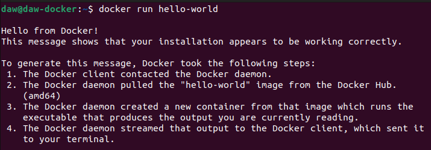


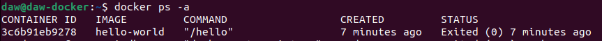

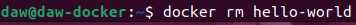

### 3. Crea un contenedor interactivo desde una imagen debian. Instala un paquete (por ejemplo nano). Sal de la terminal, ¿sigue el contenedor corriendo? ¿Por qué?. Vuelve a iniciar el contenedor y accede de nuevo a él de forma interactiva. ¿Sigue instalado el nano?. Sal del contenedor, y bórralo. Crea un nuevo contenedor interactivo desde la misma imagen. ¿Tiene el nano instalado?

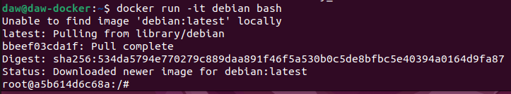

Instalamos nano:                
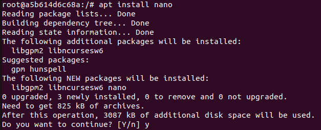

Comprobamos que no se esta ejecutando:  
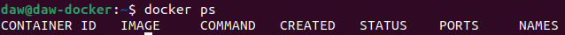

Al volver a acceder al contenedor vemos que nano sigue instalado:                    
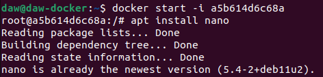

Al eliminar el contenedor y volver a instalar nano nos dice que los paquetes que se instalaran son nuevos:
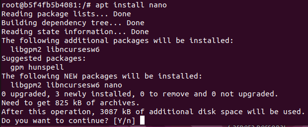

### 4. Crea un contenedor demonio con un servidor nginx, usando la imagen oficial de nginx. Al crear el contenedor, ¿has tenido que indicar algún comando para que lo ejecute? Accede al navegador web y comprueba que el servidor esta funcionando. Muestra los logs del contenedor.

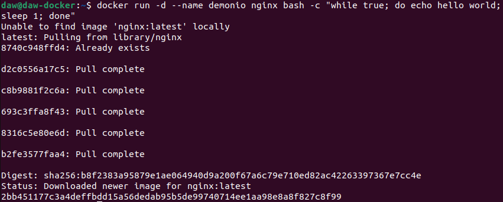

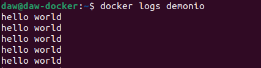

### 5. Crea un contenedor con la aplicación Nextcloud, mirando la documentación en docker Hub,para personalizar el nombre de la base de datos sqlite que va a utilizar.

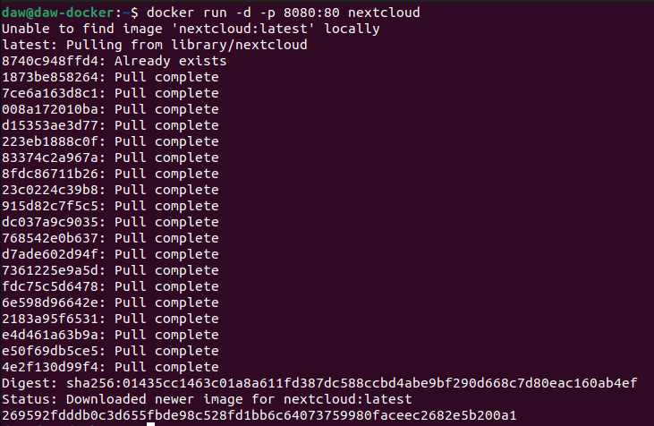

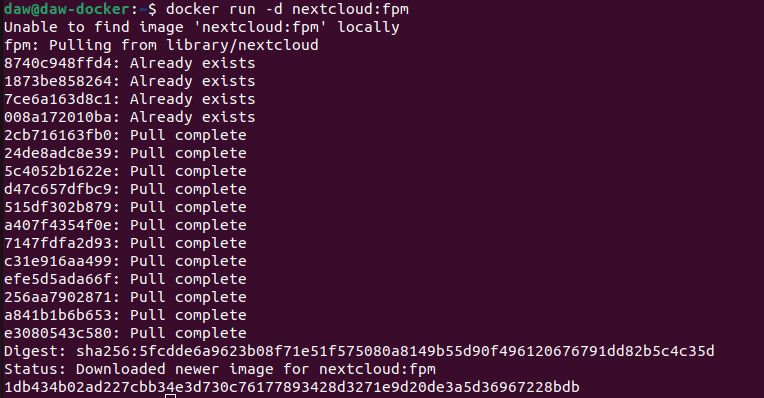

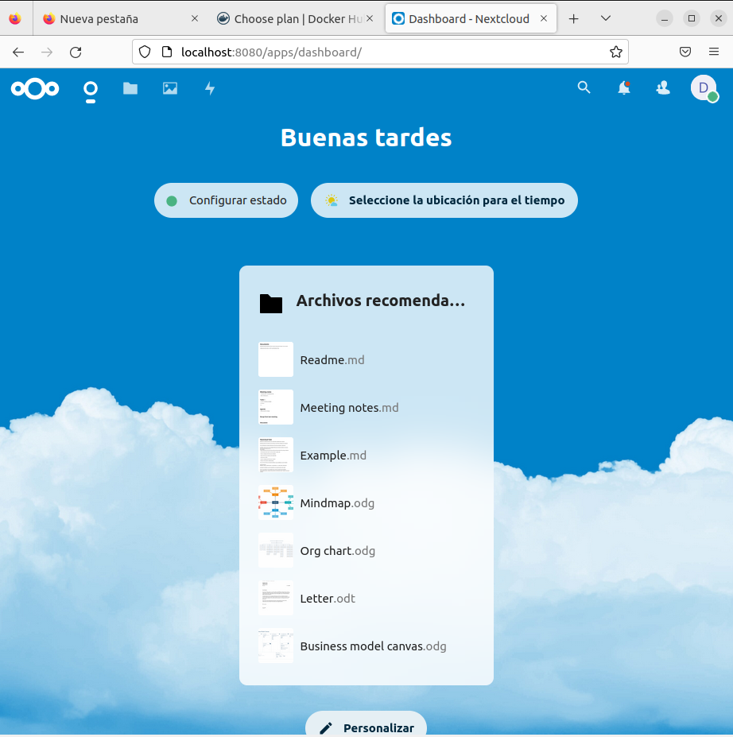

Para cambiar el nombre de la base de datos                                                      
```shh
docker run -d -p 8080:80 -e SQLITE_DATABASE=diego nextcloud
```
