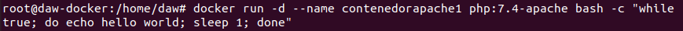
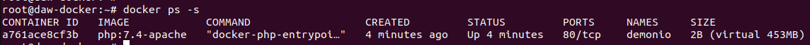
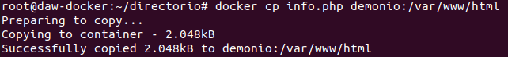
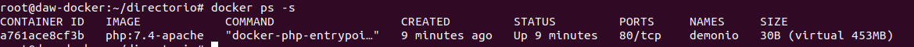
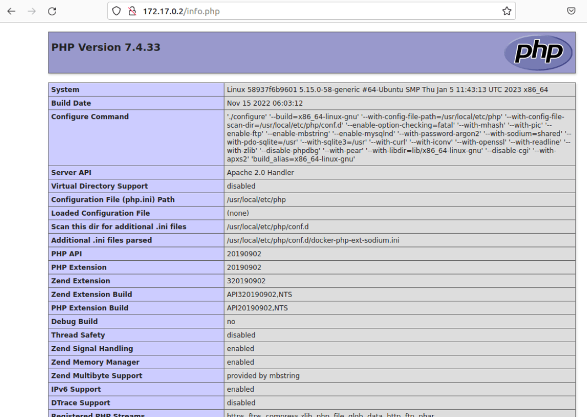

# Ejercicios Docker 2

#### 1. Descarga las siguientes imágenes: ubuntu:18.04 , httpd , tomcat:9.0.39-jdk11 , jenkins/jenkins:lts , php:7.4-apache .

```shh
docker pull httpd
docker pull ubuntu:18.04
```

#### 2. Muestras las imágenes que tienes descargadas.



#### 3. Crea un contenedor demonio con la imagen php:7.4-apache.

```shh
docker run -d --name demonio php:7.4-apache
```

#### 4. Comprueba el tamaño del contenedor en el disco duro.



#### 5. Con la instrucción docker cp podemos copiar ficheros a o desde un contenedor. Puedes encontrar información es esta página. Crea un fichero en tu ordenador, con el siguiente contenido:



#### 6. Vuelve a comprobar el espacio ocupado por el contenedor



#### 7. Accede al fichero info.php desde un navegador web.

 