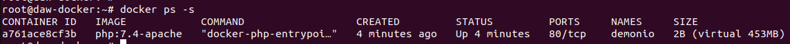
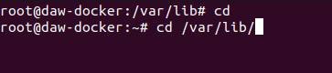
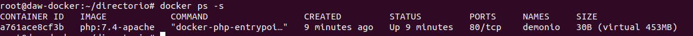
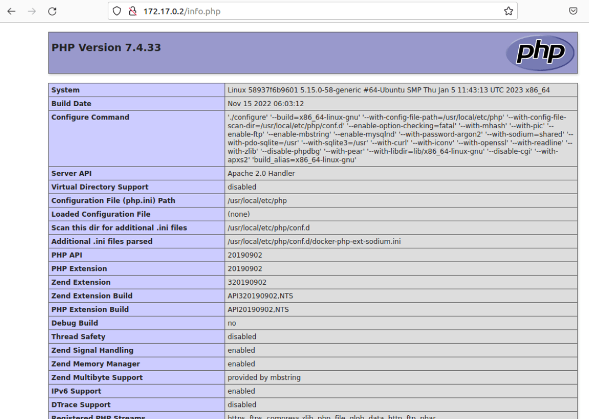
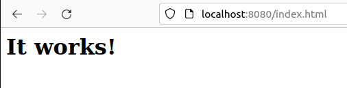

# Ejercicios Docker 2

#### 3. Crea un contenedor demonio con la imagen php:7.4-apache.

#### 4. Comprueba el tamaño del contenedor en el disco duro.

#### 5. Con la instrucción docker cp podemos copiar ficheros a o desde un contenedor. Puedes encontrar información es esta página. Crea un fichero en tu ordenador, con el siguiente contenido:

