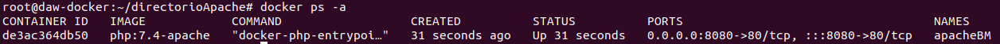

# 3 - Almacenamiento en Docker

### 1. Crea un volumen docker que se llame miweb.
```shh
docker volume create miweb
```


### 2. Crea un contenedor desde la imagen php:7.4-apache donde montes en el directorio /var/www/html (que sabemos que es el DocumentRoot del servidor que nos ofrece esa imagen) el volumen docker que has creado.

```shh
docker run -d --name apachephp -v miweb:/var/www/html -p 8080:80 php:7.4-apache
```


### 3. Utiliza el comando docker cp para copiar un fichero index.html en el directorio /var/www/html .

Para copiar:
```shh
docker cp index.html apachephp:/var/www/html
```


### 4. Accede al contenedor desde el navegador para ver la información ofrecida por el fichero index.html .


### 5. Borra el contenedor

```shh
docker rm -f -v bd26b9ae6d36
```

# Vamos a trabajar con bind mount:

### 1. Crea un directorio en tu host y dentro crea un fichero index.html .

```shh
mkdir directorioApache
cd directorioApache/
joe index.html
```


### 2. Crea un contenedor desde la imagen php:7.4-apache donde montes en el directorio /var/www/html el directorio que has creado por medio de bind mount .

```shh
docker run -d --name apacheBM -v /home/daw/directorioApache:/var/www/html -p 8080:80 php:7.4-apache
```




### 3. Accede al contenedor desde el navegador para ver la información ofrecida por el fichero index.html .

```shh
Al intentar cargar la página con el localhost salta no encuentra el fichero
```


### 5. Borra el contenedor

```shh
docker rm -f -v apacheBM
```

